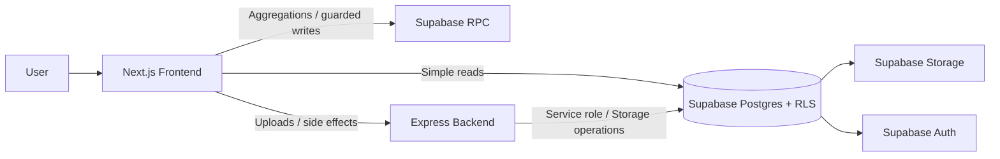
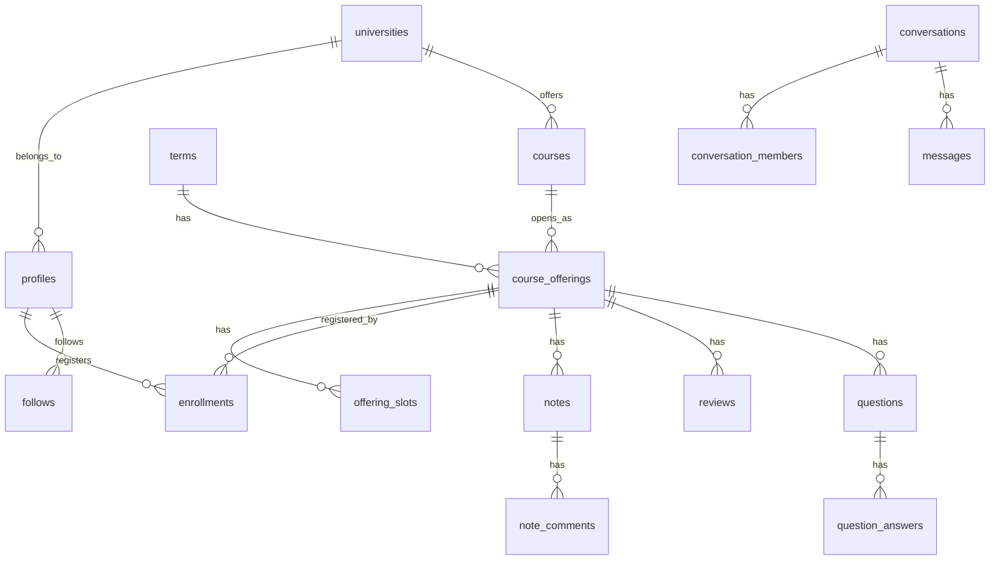

# StudyShare

大学生向けの `授業/口コミ + ノート + 時間割 + コミュニティ` アプリです。  
単なる情報掲示板ではなく、`Course` と `Offering` を分離した授業データ、`enrollments` を中核に置いた時間割、同大学スコープを前提にした投稿可視性、Supabase RLS/RPC を中心にした責務分離を設計の軸にしています。

ポートフォリオとして見る場合は、UI そのものよりも次の3点を見てください。

- 読み取りは frontend から Supabase 直参照、複雑な更新は RPC、画像アップロードなど副作用は backend に寄せたハイブリッド構成
- `enrollments` を直接公開せず、マッチングや件数集計を RPC で返すプライバシー寄りのデータ設計
- 旧 `assignments` アプリを legacy として隔離しつつ、現行ドメインへ移行したリポジトリ運用

## Screenshots

### Landing / Desktop


### Landing / Mobile


## Product Scope

現在の本体導線は次の通りです。

- `/` ランディング + Google ログイン
- `/home` ホーム
- `/offerings` 授業・口コミ一覧
- `/offerings/[offeringId]` 授業詳細
- `/offerings/[offeringId]/notes/[noteId]` ノート詳細
- `/offerings/[offeringId]/questions/[questionId]` 質問詳細
- `/timetable` 時間割
- `/community` マッチングと DM
- `/profile/[userId]` 他ユーザープロフィール
- `/me` マイページ
- `/onboarding` 大学・学年の初期設定

現状の補足です。

- `/home` は `homeMockData` ベースです
- `community` の一部タブは準備中です
- 旧 `assignments` UI は [`frontend/src/legacy/assignments/`](./frontend/src/legacy/assignments/) に退避しています
- backend の legacy API はデフォルト無効です

## Architecture



### Why this split

- `frontend -> Supabase` を読み取りの一次導線にして、一覧・詳細・本人データ取得の速度と実装量を抑える
- 他人データや複雑な権限制御が絡む処理は `RPC` に寄せて、クライアントから raw table を不用意に触らせない
- 画像アップロードや複数ステップの副作用は `backend` で受けて、Storage や認可チェックを集中管理する

### Request patterns

| Use case | Main path | Reason |
| --- | --- | --- |
| 授業一覧・詳細・プロフィール取得 | `frontend -> Supabase SELECT` | RLS で完結する読み取りは直参照が最も単純 |
| 時間割登録・講義新規作成 | `frontend -> Supabase RPC` | 重複判定や複数テーブル更新を DB 側で一貫処理したい |
| ノート画像・アバター画像 | `frontend -> backend -> Supabase Storage` | バリデーション、副作用、旧画像削除を集約したい |
| DM 開始・フォロー・集計 | `frontend -> Supabase RPC` | 他人の生データを返さずに必要情報だけ返すため |

## Domain Model

このプロダクトでは授業を次のように分けています。

- `courses`: 科目そのもの
- `course_offerings`: 学期ごとの開講実体
- `offering_slots`: 曜日・時限・教室などの時間枠
- `enrollments`: `user x offering` の履修関係

この分解により、時間割・口コミ・ノート・質問をすべて `offering_id` に束ねつつ、履修状態は `enrollments` で独立管理できます。



## Design Decisions

### 1. `enrollments` を直接公開しない

履修情報は個人データとして扱い、他ユーザーの生 `enrollments` を一覧取得させません。  
マッチングは `find_match_candidates`、件数表示は `offering_enrollment_count` のような RPC で返します。

### 2. 同大学スコープを UI と RLS の両方で揃える

ノート・口コミ・質問は、単に画面で隠すだけではなく RLS と `profiles.university_id` 前提で可視性を揃えています。  
そのため `AppRouteGuard` で `university_id` / `grade_year` 未設定ユーザーを `/onboarding` へ送ります。

### 3. 画面追加より先に SQL 側の責務境界を決める

特に DM やコミュニティは、UI 先行で local state に閉じるよりも、先に RLS / RPC / helper function を固める方針です。  
`conversation_members` の policy 再帰や `create_direct_conversation` のような境界はその考え方の典型です。

### 4. legacy を消さずに隔離する

旧 `assignments` は完全削除ではなく、互換機能として backend と frontend に残しています。  
ただし現行機能とは責務を分離し、デフォルトでは無効化しています。

## Main Tech Stack

| Layer | Stack |
| --- | --- |
| Frontend | Next.js 15, React 19, TypeScript, Tailwind CSS |
| Backend | Express, TypeScript, Multer |
| Auth / DB / Storage | Supabase Auth, Postgres, Storage, RLS, RPC |
| Validation | Zod |
| Testing | Jest, React Testing Library, Supertest |

## Repository Map

```text
studyshare/
├── frontend/
│   └── src/
│       ├── app/                 # App Router pages
│       ├── components/          # Current UI
│       ├── context/             # AuthContext
│       ├── lib/                 # Supabase / validation / utilities
│       ├── legacy/assignments/  # Old assignments UI
│       └── types/
├── backend/
│   └── src/
│       ├── middleware/
│       ├── routes/
│       ├── services/
│       └── scripts/
├── supabase/
│   └── migrations/
└── docs/
```

## Key Files

- [`frontend/src/components/auth/AppRouteGuard.tsx`](./frontend/src/components/auth/AppRouteGuard.tsx)
- [`frontend/src/context/AuthContext.tsx`](./frontend/src/context/AuthContext.tsx)
- [`frontend/src/app/(app)/timetable/page.tsx`](./frontend/src/app/(app)/timetable/page.tsx)
- [`frontend/src/app/(app)/community/page.tsx`](./frontend/src/app/(app)/community/page.tsx)
- [`backend/src/app.ts`](./backend/src/app.ts)
- [`backend/src/routes/uploads.ts`](./backend/src/routes/uploads.ts)
- [`backend/src/middleware/auth.ts`](./backend/src/middleware/auth.ts)
- [`supabase/migrations/20260216132701_init_full_schema.sql`](./supabase/migrations/20260216132701_init_full_schema.sql)

## Local Setup

```bash
pnpm install
pnpm dev:frontend
pnpm dev:backend
```

必要な環境変数の例です。

### `frontend/.env.local`

```env
NEXT_PUBLIC_SUPABASE_URL=...
NEXT_PUBLIC_SUPABASE_ANON_KEY=...
NEXT_PUBLIC_BACKEND_API_URL=http://localhost:3001/api
```

### `backend/.env.development`

```env
PORT=3001
SUPABASE_URL=...
SUPABASE_ANON_KEY=...
SUPABASE_SERVICE_ROLE_KEY=...
ENABLE_LEGACY_ASSIGNMENTS_API=false
ENABLE_LEGACY_UPLOAD_API=false
```

Storage bucket は少なくとも次を前提にしています。

- `notes`
- `avatars`
- `assignments` (`legacy`)

## Tests

```bash
pnpm test
pnpm --filter frontend test
pnpm --filter backend test
pnpm --filter backend test:ci
```

優先して見ている観点は以下です。

- `AppRouteGuard` の認証/オンボーディング分岐
- `TimetableGrid` の表示、取消、再登録、戻りハイライト
- `CreateOfferingModal` の重複候補 blocking
- `community/page` の DM 制約、既読、Realtime 追従
- backend upload API の認証、バリデーション、Storage 異常

## Documentation

- [`docs/architecture.md`](./docs/architecture.md)
- [`docs/components.md`](./docs/components.md)
- [`docs/data-model.md`](./docs/data-model.md)
- [`docs/db_schema.md`](./docs/db_schema.md)
- [`docs/security.md`](./docs/security.md)
- [`docs/testing.md`](./docs/testing.md)
- [`docs/supabase_operations.md`](./docs/supabase_operations.md)

## Notes

- この README は legacy `assignments` アプリではなく、2026-03 時点の現行 StudyShare を基準にしています
- スキーマ変更は migration ファイルを作成する前提で、worktree 上での安易な `supabase db reset` は避けます
- 認証後の主要画面は Supabase セッション前提のため、README にはランディング画面のスクリーンショットを掲載しています
