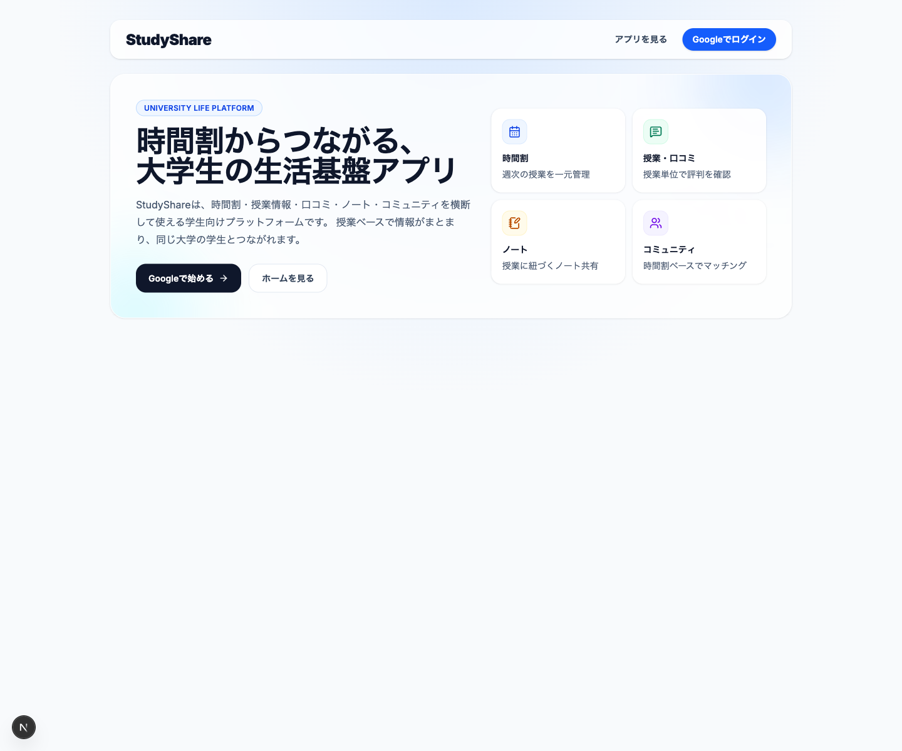
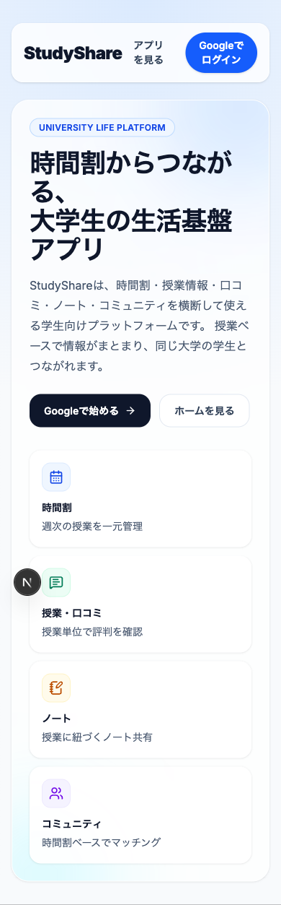
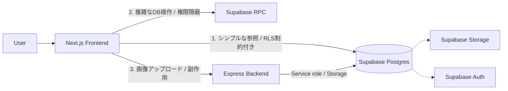
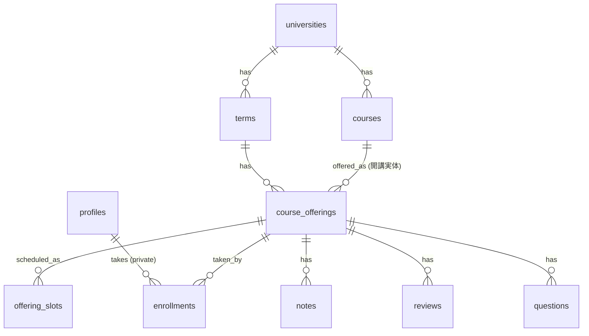

# StudyShare: 大学生向け 課題・時間割・コミュニティ統合プラットフォーム

[](https://nextjs.org/)
[](https://expressjs.com/)
[](https://supabase.com/)

> **技術ポートフォリオとしての Readme**  
> このリポジトリは、就職活動において「設計・実装・技術選定・課題解決力」を伝えるために作成・公開しています。単なる機能紹介にとどまらず、プロダクトのドメインモデリングやセキュリティ設計、利用技術の選定理由までを記載しています。

## 1. プロジェクト概要

「StudyShare」は、大学生にとって身近な「授業」を起点とし、時間割の管理から、授業ノート・口コミの共有、そして同じ授業を受ける学生同士が繋がるコミュニティ機能までをワンストップで提供するフルスタックWebアプリケーションです。

大学の公式シラバスから講義データをインポートし、「科目名（Course）」と「開講実体（Offering）」を綺麗に分離した本格的なデータベースモデリングを行っています。これにより、学生は単なる掲示板ではなく、整然と整理された時間割ベースのUIから、有益な情報交換を行うことができます。

## 2. 解決したい課題

現在、多くの大学生活では以下のような課題があります。

- **情報の分断**: 履修登録システム、講義情報、過去のノートや課題情報が、異なるシステムや個人のSNS・LINEグループ等に散在している。
- **匿名性の限界と信憑性**: 「誰が書いたか分からない」匿名の情報サイトでは、投稿の信憑性が担保されず、スパムや無意味な投稿が混ざりやすい。
- **授業コミュニティの希薄化**: 大規模なオンライン授業やパンデミック以降、同じ授業を取っている学生同士が自然に繋がる機会が激減した。

StudyShareはこれらの課題に対し、**「授業（Offering）単位で全ての情報と人が集まる場所」** を提供することで、キャンパスライフにおける情報共有とコミュニケーションをアップデートします。

## 3. 主な機能

1. **時間割＆履修管理**
   - 独自の「大学ごとの時限設定」に対応した、直感的な時間割グリッドUI。
   - 講義検索からワンクリックで履修登録し、即座に時間割UIへ反映。取消や再登録もシームレスに対応。
2. **講義情報・ノート・口コミの共有機能**
   - 授業（Offering）ごとに、ノート（画像添付可）、口コミ、質問を投稿・閲覧可能。
   - 「同一大学の学生にのみ公開」「授業履修者のみに公開」といった、きめ細かい可視性（Visibility）コントロール機構を実装。
3. **マッチング＆ダイレクトメッセージ（DM）**
   - 「同じ授業を取っている学生」を安全に抽出し、共通の話題で繋がるきっかけを提供。
   - スパム防止のため、「一定数以上のノート・口コミ投稿」や「学年」を条件とする階層化されたゲート（DM解放条件）システムを導入。
4. **大学シラバスの一括インポート**
   - Headlessブラウザ（Playwright）を用いて大学の公開シラバスから講義情報を取り込み、本番データベースの Offering へ冪等性（複数回実行しても重複しない）を持って安全に統合。

## 4. 利用イメージ / ユーザーフロー

ユーザーは主に以下のフローでStudyShareを利用します。

| フロー | ユーザー体験（UX） |
| :--- | :--- |
| **1. オンボーディング** | Google認証（Supabase Auth）後、所属大学・学年を設定。ユーザーの大学に応じた「標準時間割枠（例：5限まで等）」が自動で適用されます。 |
| **2. 時間割の作成** | `/timetable` の空きコマをタップ。シラバスデータから該当曜日の講義を検索し、ワンクリックで追加（`/timetable/add`）。 |
| **3. 授業情報の確認** | 時間割のセルをタップすると、その講義の詳細（`/offerings/[id]`）へ遷移。他の学生が投稿した「口コミ（ラク単情報等）」や「ノート」を効率よく確認できます。 |
| **4. コミュニティ** | `/community` にて、自分と共通の授業を多く履修しているマッチング候補が表示され、条件を満たせばDMで直接質問や相談が可能です。 |

### 画面イメージ




## 5. 技術スタック

**「ユーザー体験(UX)の最適化」** と **「複雑なドメインロジックの堅牢な管理」** の両立をテーマに技術選定を行いました。

### Frontend
- **Framework**: Next.js 15 (App Router), React 19
- **Language**: TypeScript
- **Styling**: Tailwind CSS
- **Validation**: Zod, React Hook Form

### Backend
- **Framework**: Express, Node.js
- **Language**: TypeScript
- **Middleware**: Multer (画像アップロード用)

### Infrastructure & Database
- **BaaS**: Supabase
- **Database**: PostgreSQL (Supabase DB)
- **Auth**: Supabase Auth
- **Storage**: Supabase Storage
- **Security**: Row Level Security (RLS)

### CI / Testing / Tooling
- pnpm Workspace (Frontend/Backend 統合リポジトリ)
- Jest, React Testing Library, Supertest

## 6. システム構成

フロントエンドから直接Supabaseを参照するCaaS的アプローチを基本にしつつも、権限が必要な操作や複雑な処理を自前バックエンド・RPCで受ける **ハイブリッド構成** を採用しています。



**【アーキテクチャの選定理由】**
1. **読み取り速度と実装コストの最適化（1）**: タイムラインや授業一覧など、RLSで安全性が担保される単純なRead処理は、Next.js（Client/Server Components）から直接Supabaseを叩き、不要なAPI層を削減。
2. **ビジネスロジックのDBカプセル化（2）**: 「講義の新規作成＋履修登録」等の複数テーブルに跨るトランザクション処理や、「他者に生データは見せないが、マッチング集計結果だけ返す」要件は、Supabase RPCにロジックを寄せて安全に処理。
3. **強い権限と副作用の分離（3）**: ファイルアップロードやリソースの物理削除など、管理者権限（Service Role）が必要な副作用処理のみを Express Backend API に集積し、フロントエンドから秘匿。

## 7. データベース設計 / ER図

大学の履修システムという複雑なドメインを正確にマッピングするため、「Course（科目）」と「Offering（開講実体）」を意図的に分離しています。



**【設計のポイント】**
- **Course と Offering の分離**:
  `courses`（恒久的な科目名）と `course_offerings`（今年度の前期における開講実体）を分離。これにより、年度ごとに担当教員や曜日が変わっても「過去のこの講義の口コミやノート」が散逸・混同しません。
- **Enrollment によるプライバシー保護の徹底**:
  時間割は `profiles` と `course_offerings` の交差テーブルである `enrollments` で管理。ここは PostgreSQLの RLS によって完全に「本人のみ参照可能」とし、プライバシーを保護。

## 8. 技術的なこだわり・工夫

### 8.1. RLS と RPC を駆使した鉄壁のプライバシー保護
「他人に自分の履修履歴を見られたくない」というストーカー対策・プライバシー保護は、学生向けコミュニティアプリで最も重要な要件です。
そのため、`enrollments` テーブルの RLS で他者からの生アクセスを完全シャットアウトしています。その上で、UI上で「同じ授業の人」をサジェストするために、`find_match_candidates` という RPC 関数をDB側に実装。これにより、**アプリケーション層（Next.js）を通さずDBの奥深くで「共通の授業があるか」を集計し、その結果（カウントのみ）を返す** ことで生データ漏洩のリスクを根本から断ち切りました。

### 8.2. 冪等な「大学シラバス」インポート基盤（Source Mappings）
各大学の公開シラバスシステム（Web）からデータをスクレイピングし、本番 DB へ反映するパイプラインを構築しています。
単純に「毎回データを全消去して再投入する」のではなく、外部IDと内部IDを紐付ける `source_mappings` テーブルを用意しました。これにより、**「既存の学生が登録した履修データや口コミ（Offeringへの紐付き）を破壊せずに、大学側で変更された講義情報（時間割変更など）の差分だけを適用・更新する」** 高度な冪等性のインポート処理を実現しています。

### 8.3. 階層化されたアクセス制御とDMゲーティング
DM機能におけるスパム・迷惑行為を防ぐため、以下のようなゲーティング（解放条件）システムを実装しました。
- 原則として「ノートや口コミを2件以上投稿してプラットフォームに貢献したユーザー」のみがDM送信可能。
- ただし、「右も左も分からない1年生」は例外として初期からDM機能を解放（情報収集を支援するため）。

これらの判定もフロントエンドに依存せず、PostgreSQLの `create_direct_conversation` RPC 内部でトランザクションとして検証しており、悪意のある直接的な API コールであっても強固に防ぎます。

## 9. 難しかった点とその解決

### 課題: 時間割UIにおける「大学ごとの『時限』の多様性」
**背景**:
大学によって「1限の開始時間」や「1日の最大時限数（5限まで / 7限まで 等）」が全く異なります。当初は固定のグリッドUIで実装していましたが、様々な大学にスケールできませんでした。

**解決策**:
DBスキーマに `timetable_presets` および `profile_timetable_settings` と呼ばれる設定テーブルを導入。JSONB型で「◯限が何時開始〜何時終了か」という動的マスタを持たせました。
フロントエンドではこの設定データに基づいてグリッドコンポーネント（`TimetableGrid`）を動的にレンダリングする設計へ大幅なリファクタリングを実施し、未知の大学が追加されても時間割UIが柔軟にスケールダウン・スケールアップする仕組みを作り上げました。

### 課題: Next.js App Router における認証状態とルーティングのちらつき
**背景**:
Supabase Auth と Next.js (SSR/CSRの混在環境) の組み合わせにおいて、ページ遷移時に一瞬「未ログイン状態」と判定されてリダイレクトループに陥るなど、セッション同期のライフサイクル管理に非常に苦労しました。

**解決策**:
認証ガード（`AppRouteGuard.tsx`）を中心に、`useAuth` コンテキストでセッション状態を一元管理する設計へ変更。単なるログイン有無の判定だけでなく、「初回プロフィールの設定有無（`university_id` や `grade_year` があるか）」までを判定基準に含めて状態遷移マシンとしてモデリングすることで、安全かつ UX を損なわないスムーズなルーティングフローを確立しました。

## 10. セットアップ方法

```bash
# 1. リポジトリのクローン
git clone <your-repository-url>
cd studyshare

# 2. パッケージのインストール (pnpmワークスペースを使用)
pnpm install

# 3. 環境変数の設定
# frontend/.env.local および backend/.env.development を作成して以下を設定してください
# NEXT_PUBLIC_SUPABASE_URL=...
# NEXT_PUBLIC_SUPABASE_ANON_KEY=...
# SUPABASE_SERVICE_ROLE_KEY=...

# 4. 開発サーバーの起動 (Frontend / Backend を並行起動)
pnpm dev:frontend  # http://localhost:3000 で Next.js 起動
pnpm dev:backend   # http://localhost:3001 で Express API 起動
```

※ ローカル開発環境で Supabase データベースを立ち上げる場合は、`npx supabase start` および `npx supabase db reset` にて初期マイグレーションを実行してください。

## 11. 今後の展望

- **情報のレコメンド機能強化**: アプリ内に蓄積された履修履歴や「お気に入り」したノートの傾向ベクターから、次学期のおすすめ授業や、より相性の良い関連ノートを自動サジェストするシステムの実装。
- **通知システムの拡充**: 現状のフォロー通知に加え、DM受信時やコメント追加時のリアルタイム通知（Supabase Realtime と PWA Push通知基盤の連携）によるエンゲージメントの向上。
- **Native App化の検証**: 現在のPWAの提供に加え、React Native / Expo をベースとした iOS/Android 向けネイティブアプリ化の技術検証（Supabase クライアントロジックの共有化）。
