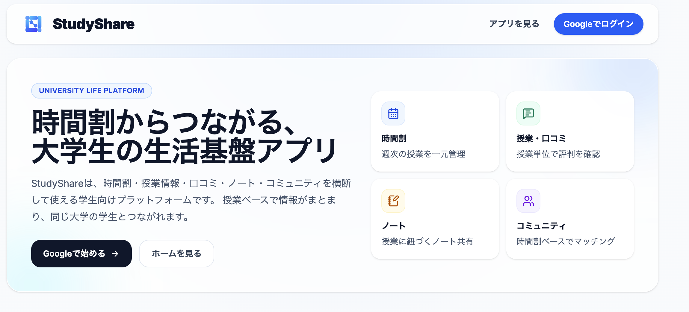
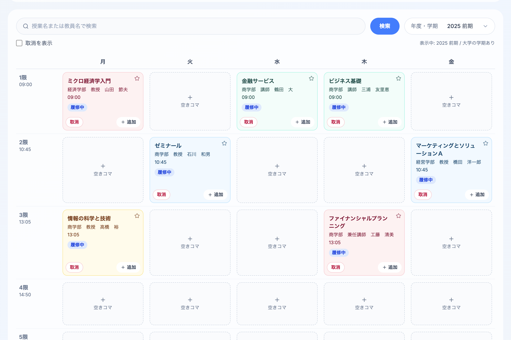
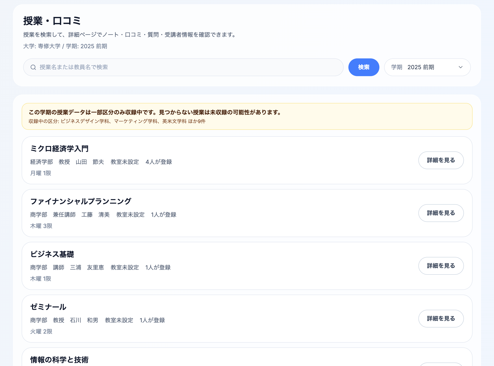
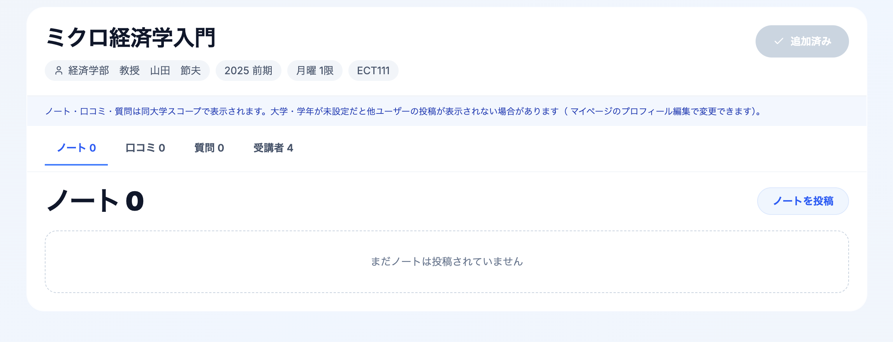
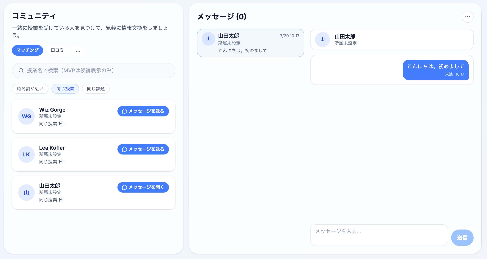
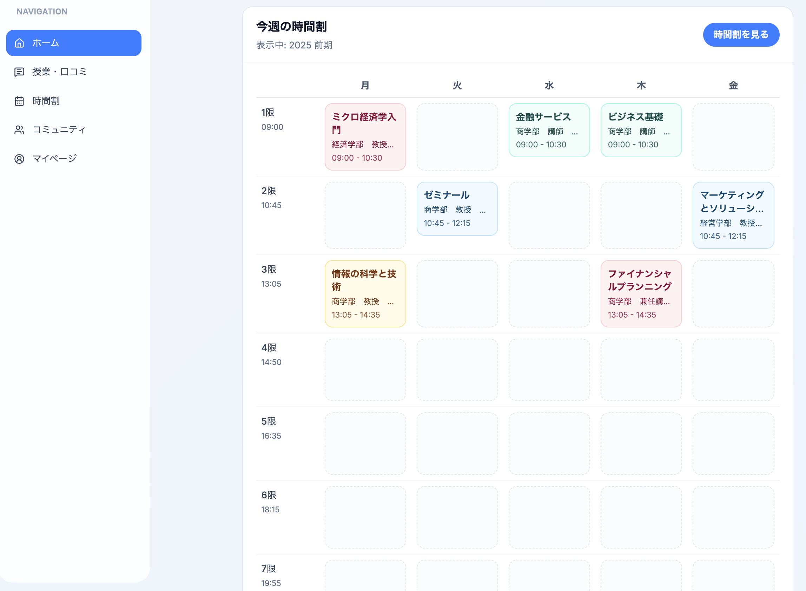
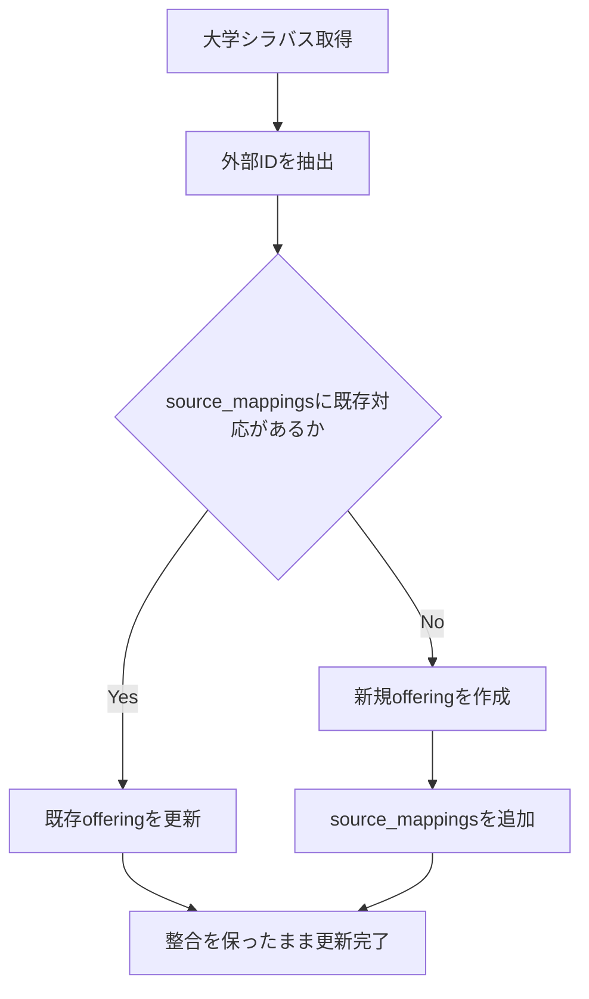
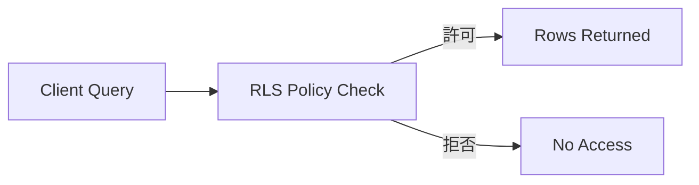

# StudyShare

> 時間割からつながる、大学生の生活基盤アプリ

[](https://nextjs.org/)
[](https://react.dev/)
[](https://www.typescriptlang.org/)
[](https://expressjs.com/)
[](https://supabase.com/)

---

## 目次

- [1. プロジェクト概要](#1-プロジェクト概要)
- [2. なぜ作ったのか](#2-なぜ作ったのか)
- [3. StudyShareでできること](#3-studyshareでできること)
- [4. 技術スタック](#4-技術スタック)
- [5. システム構成](#5-システム構成)
- [6. データベース設計 / ER図](#6-データベース設計--er図)
- [7. 技術的な工夫](#7-技術的な工夫)
- [8. 難しかった点と解決](#8-難しかった点と解決)
- [9. セットアップ方法](#9-セットアップ方法)
- [10. 今後の展望](#10-今後の展望)

---

## 1. プロジェクト概要

StudyShare は、大学生が日常的に触れる **「時間割」** を起点に、授業検索、履修管理、ノート共有、口コミ閲覧、同じ授業を取っている学生とのつながりまでを一つにまとめたフルスタック Web アプリケーションです。

大学生活の情報は、実際にはかなり分断されています。  
履修登録は大学システム、授業の感想は友人同士の会話、ノートは個人の端末、質問はLINEやSNS、同じ授業の人との接点は偶然任せ。  
StudyShare は、その分断を **「授業単位」** でつなぎ直すことを目指して作りました。

単なる時間割アプリでも、匿名掲示板でもありません。  
**授業という生活動線の中心に、人・情報・記録を集約する** ことが、このプロダクトの中核です。

### 一目でわかるプロダクトイメージ



トップ画面では、StudyShare が単なる機能集ではなく、  
**時間割・授業情報・ノート・コミュニティを横断して使う学生向けプラットフォーム** であることが直感的に伝わるように設計しています。

---

## 2. なぜ作ったのか

大学生活では、授業を中心に多くの行動が発生します。

- どの授業を取るか調べる
- 教員や曜日時限を確認する
- 時間割に登録する
- 授業の雰囲気や難しさを知りたい
- ノートや過去の知見を見たい
- 同じ授業の人に質問したい
- でも、気軽に連絡できる相手がいない

この一連の体験は本来つながっているはずなのに、実際には別々の場所に散らばっています。

たとえば、授業検索は大学公式サイト、口コミは友人経由、ノートは個人管理、質問はSNSやDM。  
しかも、大学ごとに時限構造も違えば、学期ごとに講義内容や担当教員も変わるので、単純な「科目一覧」だけでは現実の大学生活に追いつきません。

そこで StudyShare では、  
**「授業を探す」→「履修する」→「情報を見る」→「記録を残す」→「同じ授業の人とつながる」**  
という流れを、一つのアプリの中で自然につながる体験として再設計しました。

目指したのは、便利な機能を並べることではなく、  
**大学生活の中に本当に置けるプロダクト** を作ることです。

---

## 3. StudyShareでできること

### 3-1. 大学ごとの時限に対応した時間割管理

大学によって、1限の開始時刻も、コマ数も、曜日構成も異なります。  
StudyShare では、ユーザーの所属大学に応じて標準時間割を適用し、現実の大学生活に近い形で時間割を管理できます。

- 大学ごとの標準時限を適用
- 空きコマから授業検索画面へ遷移
- ワンクリックで履修登録
- 追加 / 取消をグリッドUI上で直感的に操作



この画面では、単に授業名を並べるのではなく、  
**週の生活リズムそのものを見渡せる UI** を目指しました。

---

### 3-2. 授業検索と履修登録

授業名や教員名から検索し、学期を絞り込みながら履修候補を探せます。  
収録状況が不完全な場合も UI 上で明示し、データの状態がユーザーに伝わるようにしています。



この機能で意識したのは、検索結果をただ返すことではなく、  
**履修判断に必要な情報を迷わず拾えること** です。

---

### 3-3. 授業詳細ページで情報共有

授業詳細ページでは、その授業に紐づくノート、口コミ、質問、受講者数を一つの画面に集約します。



「この授業って実際どうなんだろう」を調べるとき、  
ユーザーは複数サイトを行き来したくありません。  
StudyShare では、**授業単位で必要情報がまとまっていること** を重視しています。

ノート、口コミ、質問を投稿・閲覧でき、重要なのは誰にでも全面公開するのではなく、  
**大学スコープや履修状況に応じた可視性制御** を行っている点です。

これにより、単なる匿名掲示板ではなく、  
**「ある程度文脈の揃った学生同士」で情報交換できる場** を成立させています。

---

### 3-4. 同じ授業の学生とつながるコミュニティ / DM

StudyShare は情報共有で終わりません。  
同じ授業を受けている学生をマッチング候補として表示し、条件を満たせばメッセージでやり取りできます。



ここで重視したのは、単にDM機能を付けることではなく、  
**スパムや無差別接触を防ぎつつ、授業ベースの自然な接点を作ること** です。

---

### 3-5. ホームで今週の授業を俯瞰

時間割全体ページとは別に、ホームでは「今週の時間割」をコンパクトに俯瞰できます。



毎回フル機能の管理画面に入らなくても、  
**まずは今日・今週の授業状況がすぐ見える** ことを重視しています。

---

## 4. 技術スタック

## フロントエンド

- **Next.js 15 (App Router)**
- **React 19**
- **TypeScript**
- **Tailwind CSS**
- **React Hook Form**
- **Zod**

### 採用理由

StudyShare は、画面数が多いだけでなく、  
「時間割」「授業詳細」「オンボーディング」「コミュニティ」など、状態と導線の複雑な UI が中心です。

そのため、以下を重視してフロントエンドを構成しました。

- App Router による画面設計の整理
- TypeScript によるデータ境界の明確化
- Zod によるバリデーションの明文化
- Tailwind によるコンポーネント単位の高速なUI実装

単に早く作るためではなく、  
**機能追加が続いても破綻しにくいフロント構成** を意識しています。

---

## バックエンド

- **Express**
- **Node.js**
- **TypeScript**
- **Multer（画像アップロード処理など）**

### 採用理由

StudyShare では、すべてを BFF / API サーバーに寄せるのではなく、  
**フロント直結で十分な処理** と **バックエンドに閉じ込めるべき処理** を分けています。

Express を置いた理由は主に以下です。

- service role を使う必要がある処理をクライアントから隔離するため
- 画像アップロードや副作用を伴う処理を集約するため
- 認可や署名付きURL発行など、フロントに置きたくない責務を分離するため

つまり、Express は「全部の入口」ではなく、  
**権限分離と副作用制御のための薄い専用レイヤー** として使っています。

---

## インフラ / DB

- **Supabase**
  - Postgres
  - Auth
  - Storage
  - RPC
  - Row Level Security (RLS)

### 採用理由

StudyShare は、個人開発でありながらも、

- 認証
- データベース
- ストレージ
- ポリシーベースの権限制御

が必要なプロダクトです。

Supabase を採用することで、開発速度を確保しつつ、  
**RLS を軸にした本番品質のデータアクセス設計** を実現しました。

特にこのプロジェクトでは、  
「誰がどの授業の情報を見られるか」が重要なため、  
DB レベルで可視性制御を持てることが大きな利点でした。

---

## テスト / CI / 開発基盤

- **pnpm workspace**
- **Jest**
- **React Testing Library**
- **Supertest**
- **GitHub Actions**
- **Supabase CLI**

### 採用理由

アプリ本体に加えて、DB スキーマや import 処理も持つため、  
「コードだけ」ではなく **開発環境全体を再現可能にすること** が重要でした。

そのため、

- workspace でフロント / バック / スキーマを統合管理
- GitHub Actions で最低限のCIを回す
- Supabase CLI でマイグレーションを同期する

という構成にしています。

---

## 5. システム構成

StudyShare は、フロントから直接 Supabase を読む部分と、  
Express / RPC に寄せる部分を分けた **ハイブリッド構成** です。

```mermaid
flowchart LR
  U[User] --> F[Next.js Frontend]

  F -->|公開可能な参照 / RLSで制御| SB[(Supabase Postgres)]
  F -->|複雑なDBロジック| RPC[Supabase RPC]
  F -->|画像アップロード / 署名付きURL取得 / 副作用処理| B[Express Backend]

  B -->|Service Role| SB
  SB --> ST[Supabase Storage]
  SB --> AU[Supabase Auth]
````

### この構成にした理由

全部を Next.js から直接 Supabase に寄せると、実装は速いです。
ただし、それだけでは以下が難しくなります。

* service role を必要とする安全な処理
* 副作用を含む処理の整理
* クライアントへ漏らしたくない責務の隔離
* 複雑な更新処理や権限分離

逆に、すべてを Express に寄せると、今度は開発速度と可読性が落ちます。

そこで StudyShare では、
**「RLSで安全に読めるものは直接読む」「責務が重いものだけサーバーに寄せる」**
という設計にしました。

---

## 6. データベース設計 / ER図

StudyShare で重要なのは、
**科目そのもの** と **ある学期・曜日時限・担当教員で実際に開講されている授業** を分けている点です。

つまり、

* `course` = 科目の抽象的な定義
* `offering` = 特定年度・学期で実際に開講される授業実体

です。

この分離によって、学期ごとに教員や曜日時限が変わっても、
「同じ授業系統」と「その学期の実体」を無理なく扱えます。

### 概念ER図

```mermaid
erDiagram
  profiles ||--o{ enrollments : has
  universities ||--o{ terms : has
  universities ||--o{ timetable_presets : has
  universities ||--o{ courses : has

  courses ||--o{ offerings : has
  terms ||--o{ offerings : has

  offerings ||--o{ offering_slots : has
  offerings ||--o{ enrollments : has
  offerings ||--o{ notes : has
  offerings ||--o{ reviews : has
  offerings ||--o{ questions : has
  offerings ||--o{ source_mappings : mapped_by

  profiles ||--o{ notes : writes
  profiles ||--o{ reviews : writes
  profiles ||--o{ questions : writes
  profiles ||--o{ direct_messages : sends

  dm_threads ||--o{ direct_messages : contains
  profiles ||--o{ dm_thread_members : joins
  dm_threads ||--o{ dm_thread_members : has

  universities {
    uuid id PK
    text name
  }

  profiles {
    uuid id PK
    uuid university_id FK
    int grade_year
    text faculty
  }

  terms {
    uuid id PK
    uuid university_id FK
    int academic_year
    text code
    text display_name
  }

  courses {
    uuid id PK
    uuid university_id FK
    text title
    text course_code
  }

  offerings {
    uuid id PK
    uuid course_id FK
    uuid term_id FK
    text instructor_name
    text room_text
    text visibility_scope
  }

  offering_slots {
    uuid id PK
    uuid offering_id FK
    int weekday
    int period
    time start_time
    time end_time
  }

  enrollments {
    uuid id PK
    uuid profile_id FK
    uuid offering_id FK
    text status
  }

  notes {
    uuid id PK
    uuid offering_id FK
    uuid author_profile_id FK
    text body
    text visibility
  }

  reviews {
    uuid id PK
    uuid offering_id FK
    uuid author_profile_id FK
    text body
  }

  questions {
    uuid id PK
    uuid offering_id FK
    uuid author_profile_id FK
    text body
  }

  source_mappings {
    uuid id PK
    text source_name
    text external_id
    uuid offering_id FK
  }

  dm_threads {
    uuid id PK
  }

  dm_thread_members {
    uuid id PK
    uuid thread_id FK
    uuid profile_id FK
  }

  direct_messages {
    uuid id PK
    uuid thread_id FK
    uuid sender_profile_id FK
    text body
  }
```

### このERで表していること

この設計のポイントは、次の4つです。

1. **大学ごとの文脈を先に持つ**

   * 大学・学期・標準時間割の違いを吸収するため

2. **course と offering を分離する**

   * 学期による差分を正しく扱うため

3. **ユーザー投稿を offering に紐づける**

   * ノート・口コミ・質問の文脈を明確にするため

4. **import 用の source_mappings を持つ**

   * 外部シラバスとの対応を維持し、冪等な更新を可能にするため

---

## 7. 技術的な工夫

## 9-1. Offering と Course を分けたデータモデリング

大学の授業は、見た目上は同じ科目でも、学期が変わると実体が変わります。

* 教員が変わる
* 曜日時限が変わる
* 教室が変わる
* 開講されないこともある

ここを単一テーブルで雑に扱うと、データ更新やユーザー投稿の紐付けが破綻しやすくなります。

そこで StudyShare では、

* `courses`: 科目の概念
* `offerings`: その学期の実際の開講実体

を分けました。

これにより、
**授業の継続性と、その学期の現実の差分を両立して表現できる** ようにしています。

---

## 9-2. source_mappings による冪等なシラバスインポート

大学の公開シラバスを取り込むときに厄介なのは、
「毎回インポートを流しても重複せず、既存データとの対応も保ちたい」という点です。

新しく毎回 offering を作るだけでは、

* 同じ授業が二重三重に作られる
* 既存の履修登録や投稿との整合が崩れる

という問題が起きます。

そのために、外部システム上の授業IDと内部 offering を対応づける
`source_mappings` を設けています。



この設計により、

* 再実行に強い
* 重複を防げる
* 既存ユーザーデータを壊しにくい

という import 基盤を実現しています。

---

## 9-3. 大学ごとの時限に対応した時間割設計

大学によって、

* 1限開始時刻
* コマ数
* 曜日構成

は意外と違います。

固定の「月〜金・1〜5限」を前提にすると、汎用性がありません。
そこで、StudyShare では大学ごとに標準時限設定を持てるようにし、オンボーディング時に適用しています。

これにより、

* UIが大学文脈に自然に馴染む
* 検索や追加の体験が現実に近づく
* 将来的な大学追加にも耐えやすい

という利点があります。

---

## 9-4. RLS を前提にした可視性制御

StudyShare では、ノートや口コミは単純な全面公開ではありません。
大学スコープや履修状況に応じて表示範囲を制御する設計です。

たとえば考えるべき条件は、

* 同じ大学の学生か
* 対象授業の履修者か
* 投稿者本人か
* DMが許可された関係か

などです。

こうした制約をアプリ側だけで持つと抜け漏れが起きやすいため、
DB 側の **Row Level Security** を軸に守っています。



この方式により、フロントのバグや API の取り回しに依存しすぎない、
**DB 主導の防御線** を作っています。

---

## 9-5. DM解放条件による安全性設計

同じ授業の学生をつなげるのは便利ですが、
条件なしのDMは荒れやすいです。

そこで、StudyShare では DM を最初から全面開放するのではなく、
段階的なゲート設計を考えています。

* 共通授業がある
* 一定の活動実績がある
* 必要なプロフィール情報が揃っている

などの条件を通した相手に限定することで、
**授業ベースの自然な会話を成立させつつ、スパム性を抑える** 方針にしています。

---

## 9-6. 画像や副作用処理をバックエンドへ寄せる設計

ノート画像や署名付きURLの発行、service role が必要な処理は、
クライアントから直接触らせないようにしています。

この分離には次の狙いがあります。

* 機密権限をクライアントに持ち込まない
* Storage 周りの責務を集約する
* 副作用を伴う処理の見通しを良くする

結果として、
**Next.js は UI と軽量なデータ参照に集中し、重い責務はバックエンドへ寄せる**
構造になっています。

---

## 8. 難しかった点と解決

## 10-1. 「大学の授業」をどうデータモデル化するか

最初は単純に授業テーブルを一つ持てばよいように見えます。
しかし実際には、大学の授業は学期ごとの差分が大きく、しかもユーザー投稿や履修情報は継続的に蓄積されます。

このため、

* 概念としての授業
* その学期の授業実体
* 曜日時限
* 外部シラバスとの対応
* ユーザーの履修状態

を分けて設計する必要がありました。

ここはこのプロジェクトの中でも特に設計色が強いポイントです。

---

## 10-2. 個人開発でも権限設計を雑にしないこと

個人開発では、速度を優先して権限設計を後回しにしがちです。
ただ、このアプリは「誰に何が見えるか」が価値そのものに関わるため、そこを曖昧にできませんでした。

そのため、UI より先に

* 表示スコープ
* 所属大学
* 履修者かどうか
* 自分の投稿かどうか

を整理し、RLS に落とし込む方針を取りました。

---

## 10-3. 実際の大学運用に寄せたUIにすること

時間割や授業検索は、単にデータを表示するだけなら簡単です。
ただ、学生が本当に使うものにするには、

* 時限の見え方
* 空きコマから追加したい導線
* 今週の時間割を先に見たい体験
* 詳細ページへの遷移自然さ

など、生活動線に沿った設計が必要でした。

ここは「機能を作る」よりも「使う場面を想像する」難しさがありました。

---

## 9. セットアップ方法

### 前提

* Node.js
* pnpm
* Supabase CLI
* 必要に応じて Docker

### 1. リポジトリをクローン

```bash
git clone <YOUR_REPOSITORY_URL>
cd studyshare
```

### 2. 依存関係をインストール

```bash
pnpm install
```

### 3. 環境変数を設定

フロントエンド・バックエンドそれぞれで環境変数を設定します。

#### frontend/.env.local

```bash
NEXT_PUBLIC_SUPABASE_URL=...
NEXT_PUBLIC_SUPABASE_ANON_KEY=...
NEXT_PUBLIC_BACKEND_API_URL=...
```

#### backend/.env.development

```bash
SUPABASE_URL=...
SUPABASE_ANON_KEY=...
SUPABASE_SERVICE_ROLE_KEY=...
PORT=3001
```

### 4. Supabase ローカル環境を起動

```bash
npx supabase start
npx supabase db reset
```

### 5. 開発サーバーを起動

```bash
pnpm dev:frontend
pnpm dev:backend
```

* Frontend: `http://localhost:3000`
* Backend: `http://localhost:3001`

---

## 10. 今後の展望

StudyShare は、まだ「情報を授業単位に整理する」段階のプロダクトです。
今後は、ここに蓄積されたデータを活かして、より生活基盤に近づけていきたいと考えています。

### 今後取り組みたいこと

* **レコメンド強化**

  * 履修履歴や閲覧傾向から授業やノートを推薦

* **通知機能の強化**

  * DM、コメント、質問への反応をリアルタイム通知

* **大学対応の拡張**

  * 対応大学・学期・時限設定の拡充

* **モバイル最適化 / PWA強化**

  * 日常的に触る前提のUI体験をさらに改善

* **コミュニティ品質の向上**

  * スパム抑制、信頼指標、関係性ベースの導線強化

---

## まとめ

StudyShare は、
**「授業を探す」「時間割に入れる」「その授業の情報を見る」「ノートを共有する」「同じ授業の人とつながる」**
という、大学生の自然な流れを一つのプロダクトとして繋ぎ直すことを目指したアプリです。

技術的には、

* Next.js / Express / Supabase のハイブリッド構成
* Offering / Course の分離
* source_mappings を使った冪等なシラバス import
* RLS を前提にした権限設計
* 大学ごとの時限に対応した時間割UI

といった点に強くこだわっています。

単なる CRUD アプリではなく、
**現実の大学生活の構造をどうアプリに落とし込むか** を考えて設計・実装したプロジェクトです。

