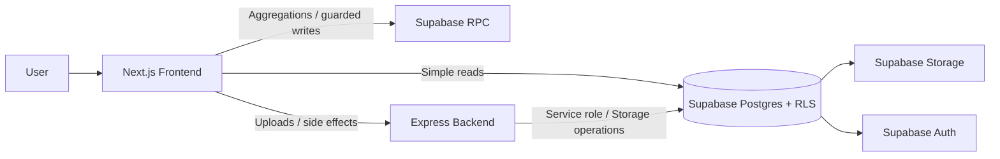
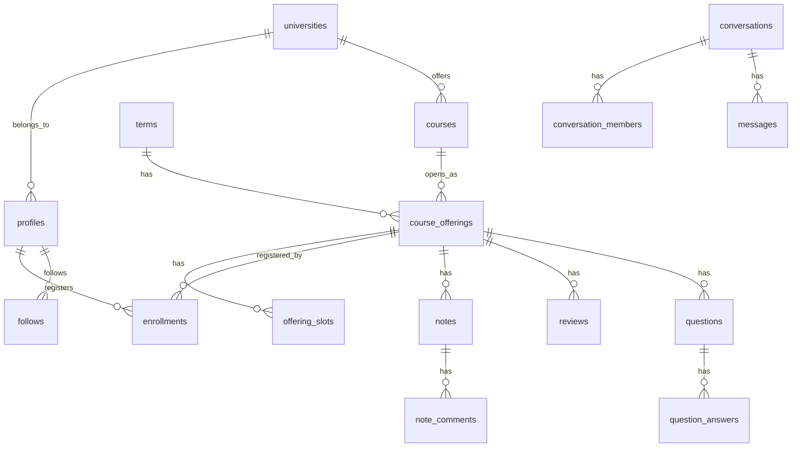

# StudyShare

大学生向けの `授業/口コミ + ノート + 時間割 + コミュニティ` アプリです。  
単なる情報掲示板ではなく、`Course` と `Offering` を分離した授業データ、`enrollments` を中核に置いた時間割、同大学スコープを前提にした投稿可視性、Supabase RLS/RPC を中心にした責務分離を設計の軸にしています。

ポートフォリオとして見る場合は、UI そのものよりも次の3点を見てください。

- 読み取りは frontend から Supabase 直参照、複雑な更新は RPC、画像アップロードなど副作用は backend に寄せたハイブリッド構成
- `enrollments` を直接公開せず、マッチングや件数集計を RPC で返すプライバシー寄りのデータ設計
- 旧 `assignments` アプリを legacy として隔離しつつ、現行ドメインへ移行したリポジトリ運用

## Screenshots

### Landing / Desktop


### Landing / Mobile


## Product Scope

現在の本体導線は次の通りです。

- `/` ランディング + Google ログイン
- `/home` ホーム
- `/offerings` 授業・口コミ一覧
- `/offerings/[offeringId]` 授業詳細
- `/offerings/[offeringId]/notes/[noteId]` ノート詳細
- `/offerings/[offeringId]/questions/[questionId]` 質問詳細
- `/timetable` 時間割
- `/community` マッチングと DM
- `/profile/[userId]` 他ユーザープロフィール
- `/me` マイページ
- `/onboarding` 大学・学年の初期設定

現状の補足です。

- `/home` は `homeMockData` ベースです
- `community` の一部タブは準備中です
- 旧 `assignments` UI は [`frontend/src/legacy/assignments/`](./frontend/src/legacy/assignments/) に退避しています
- backend の legacy API はデフォルト無効です

## Architecture



### Why this split

- `frontend -> Supabase` を読み取りの一次導線にして、一覧・詳細・本人データ取得の速度と実装量を抑える
- 他人データや複雑な権限制御が絡む処理は `RPC` に寄せて、クライアントから raw table を不用意に触らせない
- 画像アップロードや複数ステップの副作用は `backend` で受けて、Storage や認可チェックを集中管理する

### Request patterns

| Use case | Main path | Reason |
| --- | --- | --- |
| 授業一覧・詳細・プロフィール取得 | `frontend -> Supabase SELECT` | RLS で完結する読み取りは直参照が最も単純 |
| 時間割登録・講義新規作成 | `frontend -> Supabase RPC` | 重複判定や複数テーブル更新を DB 側で一貫処理したい |
| ノート画像・アバター画像 | `frontend -> backend -> Supabase Storage` | バリデーション、副作用、旧画像削除を集約したい |
| DM 開始・フォロー・集計 | `frontend -> Supabase RPC` | 他人の生データを返さずに必要情報だけ返すため |

## Domain Model

このプロダクトでは授業を次のように分けています。

- `courses`: 科目そのもの
- `course_offerings`: 学期ごとの開講実体
- `offering_slots`: 曜日・時限・教室などの時間枠
- `enrollments`: `user x offering` の履修関係

この分解により、時間割・口コミ・ノート・質問をすべて `offering_id` に束ねつつ、履修状態は `enrollments` で独立管理できます。



## Design Decisions

### 1. `enrollments` を直接公開しない

履修情報は個人データとして扱い、他ユーザーの生 `enrollments` を一覧取得させません。  
マッチングは `find_match_candidates`、件数表示は `offering_enrollment_count` のような RPC で返します。

### 2. 同大学スコープを UI と RLS の両方で揃える

ノート・口コミ・質問は、単に画面で隠すだけではなく RLS と `profiles.university_id` 前提で可視性を揃えています。  
そのため `AppRouteGuard` で `university_id` / `grade_year` 未設定ユーザーを `/onboarding` へ送ります。

### 3. 画面追加より先に SQL 側の責務境界を決める

特に DM やコミュニティは、UI 先行で local state に閉じるよりも、先に RLS / RPC / helper function を固める方針です。  
`conversation_members` の policy 再帰や `create_direct_conversation` のような境界はその考え方の典型です。

### 4. legacy を消さずに隔離する

旧 `assignments` は完全削除ではなく、互換機能として backend と frontend に残しています。  
ただし現行機能とは責務を分離し、デフォルトでは無効化しています。

## Main Tech Stack

| Layer | Stack |
| --- | --- |
| Frontend | Next.js 15, React 19, TypeScript, Tailwind CSS |
| Backend | Express, TypeScript, Multer |
| Auth / DB / Storage | Supabase Auth, Postgres, Storage, RLS, RPC |
| Validation | Zod |
| Testing | Jest, React Testing Library, Supertest |

## Repository Map

```text
studyshare/
├── frontend/
│   └── src/
│       ├── app/                 # App Router pages
│       ├── components/          # Current UI
│       ├── context/             # AuthContext
│       ├── lib/                 # Supabase / validation / utilities
│       ├── legacy/assignments/  # Old assignments UI
│       └── types/
├── backend/
│   └── src/
│       ├── middleware/
│       ├── routes/
│       ├── services/
│       └── scripts/
├── supabase/
│   └── migrations/
└── docs/
```

## Key Files

- [`frontend/src/components/auth/AppRouteGuard.tsx`](./frontend/src/components/auth/AppRouteGuard.tsx)
- [`frontend/src/context/AuthContext.tsx`](./frontend/src/context/AuthContext.tsx)
- [`frontend/src/app/(app)/timetable/page.tsx`](./frontend/src/app/(app)/timetable/page.tsx)
- [`frontend/src/app/(app)/community/page.tsx`](./frontend/src/app/(app)/community/page.tsx)
- [`backend/src/app.ts`](./backend/src/app.ts)
- [`backend/src/routes/uploads.ts`](./backend/src/routes/uploads.ts)
- [`backend/src/middleware/auth.ts`](./backend/src/middleware/auth.ts)
- [`supabase/migrations/20260216132701_init_full_schema.sql`](./supabase/migrations/20260216132701_init_full_schema.sql)

## Local Setup

```bash
pnpm install
pnpm dev:frontend
pnpm dev:backend
```

必要な環境変数の例です。

### `frontend/.env.local`

```env
NEXT_PUBLIC_SUPABASE_URL=...
NEXT_PUBLIC_SUPABASE_ANON_KEY=...
NEXT_PUBLIC_BACKEND_API_URL=http://localhost:3001/api
```

### `backend/.env.development`

```env
PORT=3001
SUPABASE_URL=...
SUPABASE_ANON_KEY=...
SUPABASE_SERVICE_ROLE_KEY=...
ENABLE_LEGACY_ASSIGNMENTS_API=false
ENABLE_LEGACY_UPLOAD_API=false
```

Storage bucket は少なくとも次を前提にしています。

- `notes`
- `avatars`
- `assignments` (`legacy`)

## Tests

```bash
pnpm test
pnpm --filter frontend test
pnpm --filter backend test
pnpm --filter backend test:ci
```

優先して見ている観点は以下です。

- `AppRouteGuard` の認証/オンボーディング分岐
- `TimetableGrid` の表示、取消、再登録、戻りハイライト
- `CreateOfferingModal` の重複候補 blocking
- `community/page` の DM 制約、既読、Realtime 追従
- backend upload API の認証、バリデーション、Storage 異常

## Documentation

- [`docs/architecture.md`](./docs/architecture.md)
- [`docs/components.md`](./docs/components.md)
- [`docs/data-model.md`](./docs/data-model.md)
- [`docs/db_schema.md`](./docs/db_schema.md)
- [`docs/security.md`](./docs/security.md)
- [`docs/testing.md`](./docs/testing.md)
- [`docs/supabase_operations.md`](./docs/supabase_operations.md)

## Notes

- この README は legacy `assignments` アプリではなく、2026-03 時点の現行 StudyShare を基準にしています
- スキーマ変更は migration ファイルを作成する前提で、worktree 上での安易な `supabase db reset` は避けます
- 認証後の主要画面は Supabase セッション前提のため、README にはランディング画面のスクリーンショットを掲載しています


# StudyShare

大学生向けの課題・ノート・履修情報共有プラットフォームです。
学生が **授業ごとに情報を集約し、課題やノートを探し、時間割を管理し、同じ授業の学生とつながれる** ことを目指して開発しています。

StudyShare は、単なる「投稿アプリ」ではなく、大学の講義データ・履修体験・ユーザー生成コンテンツを一つの導線にまとめることを目的としたフルスタック Web アプリケーションです。

---

## Why this project exists

大学生活では、次のような問題が起きがちです。

* どの授業で何が出るのか分かりにくい
* 過去の課題やノートが個人間で閉じていて再利用しづらい
* 同じ授業を取っている人を見つけにくい
* 履修登録や時間割管理が分散しやすい
* 大学の公開シラバスや講義情報が使いづらい

StudyShare はこれらをまとめて解決するために、

* **講義単位で情報を整理できる構造**
* **学生が投稿・検索・再利用できる共有導線**
* **時間割と履修情報を起点にした体験設計**
* **大学ごとの公開講義データを取り込む仕組み**

を備えたアプリとして設計しています。

---

## Main features

### 1. Assignment / note sharing

* 授業ごとに課題・ノートを投稿
* タイトル / 本文 / 画像付き投稿
* 全文検索や絞り込みによる探索
* 将来的には品質評価や通報・モデレーションにも対応予定

### 2. Timetable management

* 自分の履修情報を登録
* 学期ごとの時間割を管理
* 大学・学年・学期に応じた時間割設定
* 大学ごとの時限データに対応

### 3. University course ingestion

* 大学の公開シラバスから講義データをインポート
* 学期や年度ごとの講義変更に対応
* 既存の本番 offering データと整合性を取りながら更新
* 冪等性を保つための source mapping ベースの設計

### 4. Authentication and user profiles

* Supabase Auth による認証
* ユーザープロフィール管理
* 初回プロフィールセットアップ
* 権限に応じた表示・操作制御

### 5. Search and discovery

* 投稿・講義・関連情報の検索
* 将来的に「同じ授業を取っている学生」や「関連ノート」の発見導線も拡張予定

---

## Architecture

StudyShare は、フロントエンド・バックエンド・BaaS を分離した構成です。

```text
Frontend (Next.js)
   ↓
Backend API (Express)
   ↓
Supabase (Auth / Postgres / Storage)
```

### Frontend

* **Next.js (App Router)**
* **TypeScript**
* **Tailwind CSS**
* React ベースの UI コンポーネント設計

役割:

* UI / UX
* 認証状態に応じた画面制御
* 投稿、検索、時間割編集などのクライアント体験
* 一部 API Route を経由した安全なデータ取得

### Backend

* **Express + TypeScript**

役割:

* バリデーション
* 認証トークン検証
* 業務ロジックの集約
* 画像アップロードや検索処理
* インポートジョブなどのサーバーサイド処理

### Database / Auth / Storage

* **Supabase**
* **PostgreSQL**
* **Supabase Auth**
* **Supabase Storage**

役割:

* ユーザー認証
* 投稿・履修・講義・プロフィールデータ管理
* 行レベルセキュリティ (RLS)
* 画像などのファイル保存

---

## Tech stack

### Frontend

* Next.js
* React
* TypeScript
* Tailwind CSS

### Backend

* Express
* Node.js
* TypeScript
* Multer (upload)
* Zod / validation utilities

### Database / Infra

* Supabase
* PostgreSQL
* Supabase Storage
* Supabase Auth

### Tooling

* pnpm workspace
* GitHub Actions
* ESLint
* Vercel / Render / Supabase hosted infrastructure

---

## Repository structure

```text
studyshare/
├── frontend/   # Next.js app
├── backend/    # Express API server
├── supabase/   # migrations, seeds, SQL related files
├── docs/       # design notes, architecture, operation docs
└── ...
```

より詳細には、概ね次のような責務を持ちます。

```text
frontend/
  src/app/          # App Router pages / route handlers
  src/components/   # UI components
  src/lib/          # client utilities
  src/hooks/        # custom hooks
  src/types/        # shared frontend types

backend/
  src/routes/       # API routes
  src/controllers/  # request handlers
  src/services/     # business logic
  src/middleware/   # auth / validation / error handling
  src/scripts/      # import and operational scripts

supabase/
  migrations/       # SQL migrations
  seed.sql / seeds  # initial data
```

---

## Data model design highlights

StudyShare では、講義データを seed の固定マスタではなく、**年度・学期で変化する運用データ**として扱う方針を採っています。

特に重要なのは次の点です。

### Offering-centered design

* 講義の「本体」を `offering` として扱う
* 年度・学期・担当教員・曜日時限の変化を反映できる構造にする
* ユーザーの履修や投稿が offering に紐づく

### Import without breaking production consistency

大学の公開シラバスを取り込む際、別テーブルに隔離して終わるのではなく、既存のアプリ本体データと整合性を取りながら更新できるようにしています。

### Idempotent import via source mappings

インポートジョブを複数回実行しても同じ講義が重複生成されないように、外部ソース上の講義識別子と内部 offering を紐づける **source mapping** を採用しています。

この設計により、

* 再インポート
* 差分更新
* 同一講義の再解決
* 本番テーブル直接更新時の重複防止

が可能になります。

---

## Security

このプロジェクトでは、学生向け共有サービスとして最低限必要なセキュリティを重視しています。

* Supabase Auth による認証
* RLS による行単位のアクセス制御
* サーバー側での JWT 検証
* CORS / security headers の設定
* レートリミット導入
* 画像アクセスの private 化と signed URL 対応
* 入力値バリデーション

特に「投稿画像を単純公開 URL にしない」「クライアントだけで権限制御しない」といった点を重視しています。

---

## Local development

### Prerequisites

* Node.js
* pnpm
* Supabase CLI
* Docker (ローカル Supabase を使う場合)

### 1. Clone

```bash
git clone <your-repository-url>
cd studyshare
```

### 2. Install dependencies

```bash
pnpm install
```

### 3. Configure environment variables

フロントエンド・バックエンドそれぞれで `.env` 系ファイルを設定してください。

例:

```bash
frontend/.env.local
backend/.env
```

必要な値の例:

```env
NEXT_PUBLIC_SUPABASE_URL=
NEXT_PUBLIC_SUPABASE_ANON_KEY=
SUPABASE_SERVICE_ROLE_KEY=
BACKEND_PORT=
FRONTEND_URL=
```

実際の変数名は各アプリケーション側の実装に合わせて設定してください。

### 4. Start development servers

```bash
pnpm --filter frontend dev
pnpm --filter backend dev
```

### 5. Start Supabase (optional local setup)

```bash
npx supabase start
npx supabase db reset
```

---

## Database migrations

Supabase migration ベースでスキーマを管理しています。

```bash
npx supabase migration up --linked
```

またはローカル環境で:

```bash
npx supabase db reset
```

スキーマ変更時は migration を追加し、アプリコードと一緒に管理する運用を前提としています。

---

## Course import operations

StudyShare では、大学の公開講義データをアプリに取り込むための import script を運用しています。

主な考え方は以下です。

* seed ではなく import job として扱う
* offering を直接更新するが、重複制御を入れる
* source mapping で外部講義 ID と内部データを対応づける
* 冪等実行できるようにする
* 年度・学期ごとの差分に対応する

これにより、大学ごとにデータ形式が異なっても、最終的にはアプリ内の共通 offering モデルへ正規化できます。

---

## Deployment

環境に応じて、以下のような構成を想定しています。

### Frontend

* Vercel

### Backend

* Render などの Node.js 対応ホスティング

### Database / Auth / Storage

* Supabase hosted project

本番では、

* フロントエンドとバックエンドの環境変数整合
* CORS の許可 origin
* signed URL の取得経路
* DB migration の適用状況

を確認する必要があります。

---

## Current focus

現在の開発では、主に以下に注力しています。

* 時間割体験の改善
* 大学講義データの安定インポート
* offering / term / enrollment 周辺の整合性強化
* セキュリティ改善
* 投稿・画像・検索導線の品質向上

---

## Roadmap

* [ ] 大学講義データ対応校の拡張
* [ ] 投稿品質評価 / 通報 / モデレーション
* [ ] 同一授業ユーザーのマッチング導線
* [ ] より強力な検索・推薦
* [ ] UI / UX polish
* [ ] 運用監視と管理画面の強化

---

## Screenshots

必要に応じてここに追加してください。

```md


```

---

## Motivation as a developer

このプロジェクトでは、単に機能を作るだけでなく、次のようなテーマに向き合っています。

* 学生向けサービスとして実際に使える情報設計
* 年度・学期で揺れる講義データのモデリング
* BaaS と独自バックエンドをどう分担するか
* 本番データ整合性を壊さずにインポート運用する方法
* セキュリティと開発速度の両立

そのため StudyShare は、ポートフォリオとしても
**UI / frontend / backend / DB schema / auth / storage / operations**
を横断して設計・実装している点が特徴です。

---

## Contributing

現在は個人開発プロジェクトですが、設計や実装方針についてのフィードバックは歓迎します。

将来的には以下を整備予定です。

* contribution guide
* issue template
* PR template

---
