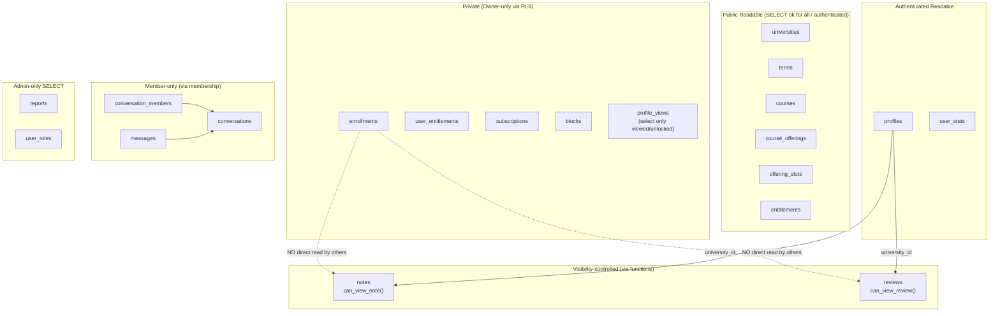

```mermaid
erDiagram
  universities ||--o{ terms : has
  universities ||--o{ courses : has
  terms ||--o{ course_offerings : has
  courses ||--o{ course_offerings : offered_as
  course_offerings ||--o{ offering_slots : scheduled_as

  auth_users ||--|| profiles : has
  auth_users ||--|| user_stats : has

  auth_users ||--o{ enrollments : takes
  course_offerings ||--o{ enrollments : taken_by

  course_offerings ||--o{ notes : has
  auth_users ||--o{ notes : writes
  notes ||--o{ note_assets : attaches
  notes ||--o{ note_reactions : reacts
  notes ||--o{ note_comments : commented_by
  auth_users ||--o{ note_reactions : reacts
  auth_users ||--o{ note_comments : writes

  course_offerings ||--o{ reviews : has
  auth_users ||--o{ reviews : writes
  course_offerings ||--o{ questions : has
  auth_users ||--o{ questions : writes

  auth_users ||--o{ blocks : blocks
  auth_users ||--o{ reports : reports
  auth_users ||--o{ profile_views : views

  auth_users ||--o{ connections : connects

  conversations ||--o{ conversation_members : includes
  auth_users ||--o{ conversation_members : joins
  conversations ||--o{ messages : has
  auth_users ||--o{ messages : sends

  entitlements ||--o{ user_entitlements : grants
  auth_users ||--o{ user_entitlements : has
  auth_users ||--o{ subscriptions : has

  universities {
    uuid id PK
    text name UK
  }
  terms {
    uuid id PK
    uuid university_id FK
    int year
    term_season season
    date start_date
    date end_date
  }
  courses {
    uuid id PK
    uuid university_id FK
    text course_code "UK (partial)"
    text name
    uuid created_by FK
  }
  course_offerings {
    uuid id PK
    uuid course_id FK
    uuid term_id FK
    text section
    text instructor
    text syllabus_url
    uuid created_by FK
  }
  offering_slots {
    uuid id PK
    uuid offering_id FK
    int day_of_week
    int period
    time start_time
    time end_time
  }
  profiles {
    uuid user_id PK
    uuid university_id FK
    text display_name
    text handle "UK (university_id, handle)"
    dm_scope dm_scope
    boolean allow_dm
  }
  enrollments {
    uuid user_id PK
    uuid offering_id PK
    enrollment_status status
    enrollment_visibility visibility
  }
  notes {
    uuid id PK
    uuid offering_id FK
    uuid author_id FK
    note_visibility visibility
    timestamptz deleted_at
  }
  reviews {
    uuid id PK
    uuid offering_id FK
    uuid author_id FK
    int rating_overall
    timestamptz deleted_at
  }
  questions {
    uuid id PK
    uuid offering_id FK
    uuid author_id FK
    text title
    timestamptz deleted_at
  }
  conversations {
    uuid id PK
    text kind
    text direct_key UK
  }
  messages {
    uuid id PK
    uuid conversation_id FK
    uuid sender_id FK
    timestamptz deleted_at
  }
  user_entitlements {
    uuid user_id PK
    text entitlement_key PK
    boolean active
    timestamptz expires_at
  }
  subscriptions {
    uuid id PK
    uuid user_id FK
    subscription_status status
    timestamptz current_period_end
  }
```

```mermaid
sequenceDiagram
  autonumber
  participant A as User A
  participant DB as Supabase(DB/RLS)
  participant RPC as RPC(Function)

  rect rgb(245,245,245)
  note over A,DB: Matching (safe)<br/>enrollments are private; only aggregates returned
  A->>RPC: find_match_candidates(limit,min_shared)
  RPC->>DB: join enrollments(e1,e2) on offering_id (visibility match_only/public)
  DB-->>RPC: rows: matched_user_id + shared_offering_count
  RPC->>DB: join profiles for display fields
  RPC-->>A: candidates (no raw offerings)
  end

  rect rgb(245,245,245)
  note over A,DB: DM gating (MVP): 2+ contributions<br/>OR entitlement/subscription<br/>OR first-year exempt<br/>Replies allowed after receiving a DM
  A->>RPC: create_direct_conversation(other_user_id)
  RPC->>RPC: can_dm(sender,recipient)?
  RPC->>DB: checks blocks + allow_dm + can_send_message (MVP ignores dm_scope/shared_offering)
  alt allowed
    RPC->>DB: upsert conversations by direct_key
    RPC->>DB: insert conversation_members (2 users)
    RPC-->>A: conversation_id
    A->>DB: insert messages(sender_id, conversation_id, body)
    DB-->>A: ok
  else not allowed
    RPC-->>A: error "not allowed"
  end
  end
```
